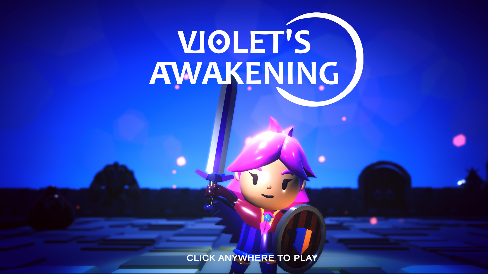
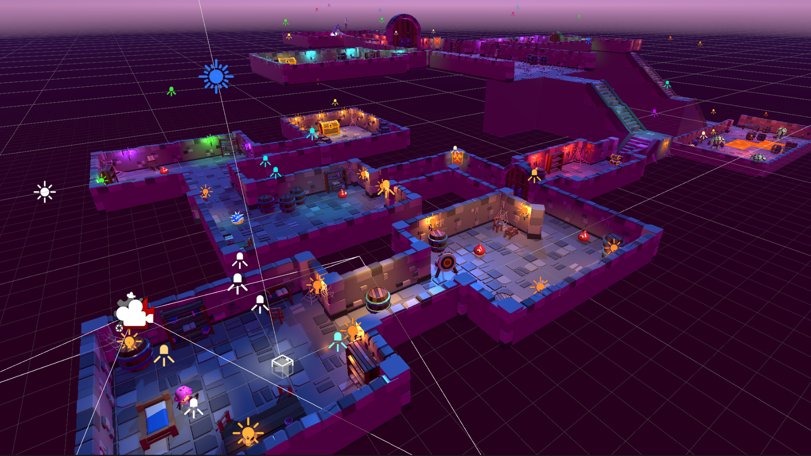
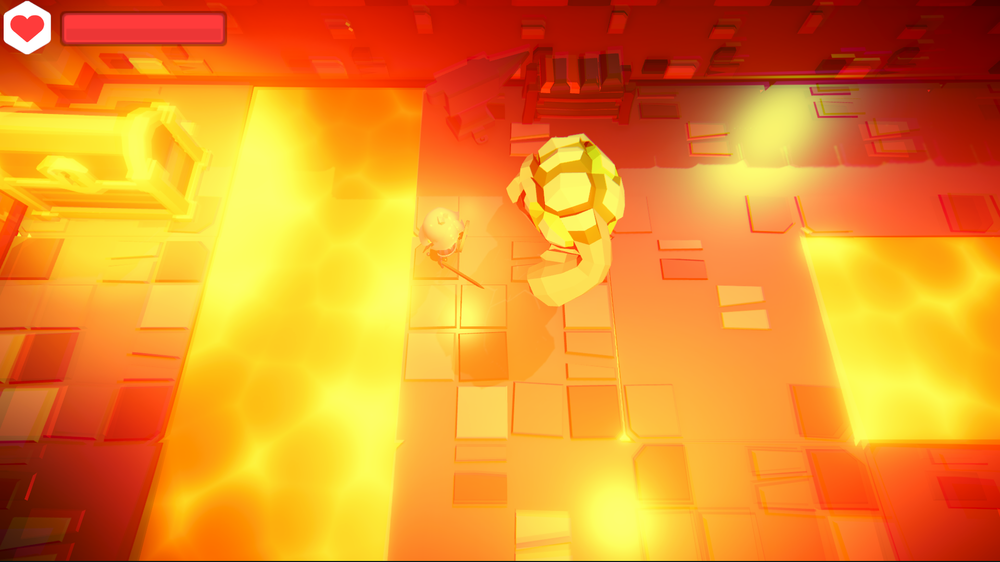
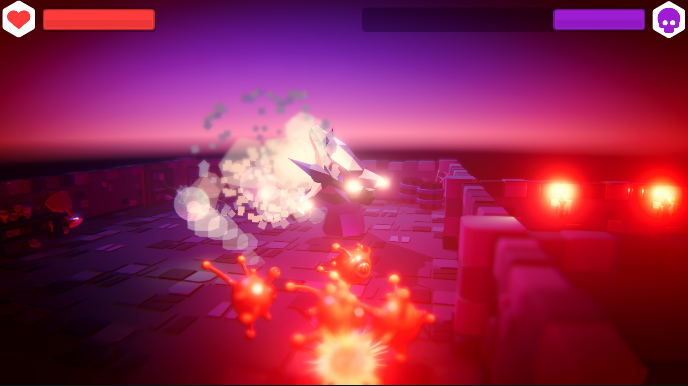

# DIO - Trilha Unity

Aqui você pode encontrar todos os projetos Unity criados durante a trilha de Desenvolvedor Unity 3D no curso da DIO, por Rafa Skoberg.
Os projetos estão organizados por módulos, e são nomeados de acordo com os nomes dados durante as próprias aulas.

Fique a vontade para fazer download do repositório inteiro e abrir projetos específicos no Unity para referência ou consulta. 😁

# Links Importantes

1. Página do repositório central da trilha: https://github.com/digitalinnovationone/trilha-unity​
2. Documentação e Manual do Unity: https://docs.unity3d.com/
3. Download de pacotes de assets para nossos módulos:
https://academiapme-my.sharepoint.com/:f:/g/personal/leonardo_ropelato_dio_me/EpRQt5ZHIVJHi0ChnSaiVzgBPXL1csMIUGzv6_8sDAJJgQ?e=v7nUQi

# Screenshots

Aqui estão alguns dos jogos que vamos desenvolver ao longo da trilha.

  
  
  
  

  
  
  

# Notas

_Toda a trilha foi desenvolvida usando a versão **2021.3.1f1.32** do Unity._
